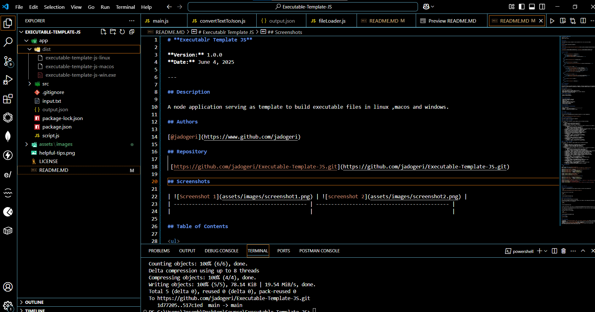
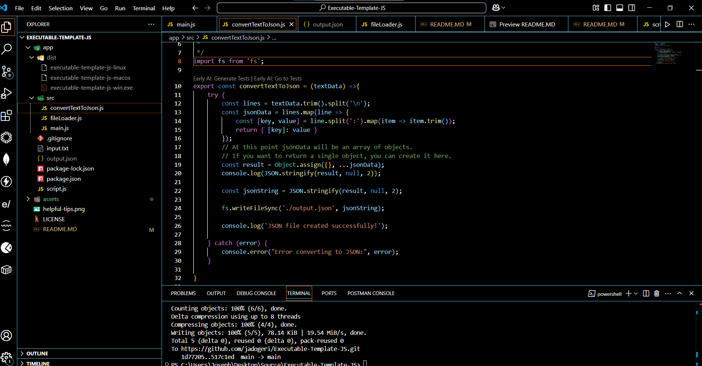
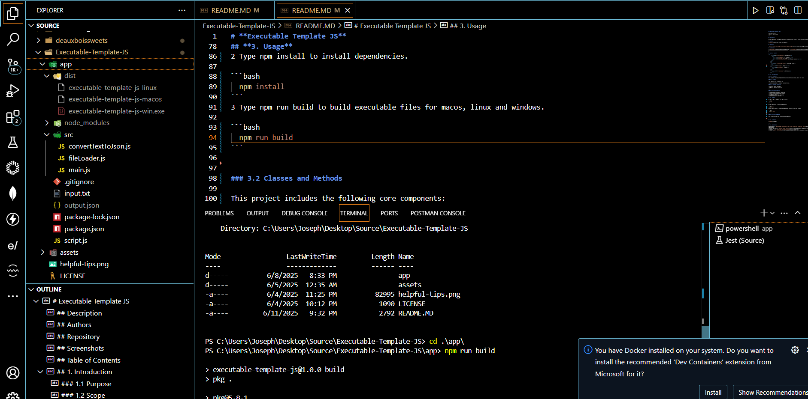
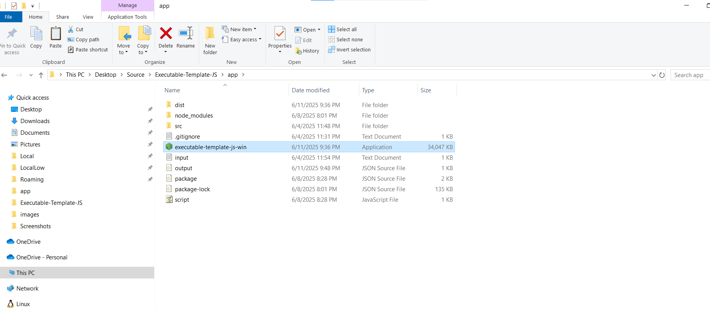

# **Executable Template JS**

**Version:** 1.0.0
**Date:** June 4, 2025

---

## Description

A node application serving as template to build executable files for linux ,macos and windows.

## Authors

[@jadogeri](https://www.github.com/jadogeri)

## Repository

 [https://github.com/jadogeri/Executable-Template-JS.git](https://github.com/jadogeri/Executable-Template-JS.git)

## Screenshots

|  |  |
| -------------------------------------------- | -------------------------------------------- |
|                                              |                                              |

## Table of Contents

<ul>
      <li><a href="#1-introduction">1. Introduction</a>
        <ul>
          <li><a href="#11-purpose">1.1 Purpose</a> </li>
          <li><a href="#12-scope">1.2 Scope</a> </li>
          <li><a href="#13-intended-audience">1.3 Intended Audience</a> </li>
        </ul>
      </li>
    </ul>
    <ul>
      <li><a href="#2-technology-stack">2. Technology Stack</a>
      </li>
    </ul>
        <li><a href="#3-usage">3. Usage</a> </li>
        <ul>
          <li><a href="#31-testing-the-executable-windows">3.1 Testing the Executable</a> </li>
        </ul>
    <ul>  
        <li><a href="#4-license">4. License</a>
        </li>
    </ul> 
    <ul> 
        <li><a href="#5-references">5. References</a>
        </li>
    <ul>

## **1. Introduction**

### **1.1 Purpose**

This document outlines a template to build executables in windows, macos and linux.

### **1.2 Scope**

This template will allow users to:

- Create executables in windows, macos and linux.

### **1.3 Intended Audience**

- Junior or Senior developers.
- Beginners learning javascript.

---

### **2. Technology Stack**

- **Programming Languages**: Javascript
- **IDE**: Visual Studio Code (VSCode)
- **Plugins**: Early AI
- **Source Control**: Git and GitHub
- **Code Analysis**: SonarQube

## **3. Usage**

0 Open a terminal then type git clone https://github.com/jadogeri/Executable-Template-JS.git
to download to project.

```bash
git clone https://github.com/jadogeri/Executable-Template-JS.git

```

1 Type cd app to navigate into the app directory.

```bash
  cd app
```

2 Type npm install command to install dependencies.

```bash
  npm install 
```
3 Type npm run build to generate executable files for macos, linux and windows.
Three files will be located in the dist directory.

```bash
  npm run build
```

 


### 3.1 Testing The Executable (windows) ###

4 Copy (executable-template-js-win.exe) in dist directory to app directory.

5 Double click on executable-template-js-win.exe. An output json file will be created.

 

## **4. License**

[LICENSE](/LICENSE)

---

## **5. References**

* FreeCodeCamp : [Frontend Web Development: (HTML, CSS, JavaScript, TypeScript, React)](https://www.youtube.com/watch?v=MsnQ5uepIa).
* AweSome Open Source : [Awesome Readme Templates](https://awesomeopensource.com/project/elangosundar/awesome-README-templates)
* Readme.so : [The easiest way to create a README](https://readme.so/)
* Medium : [How to fix__dirname](https://iamwebwiz.medium.com/how-to-fix-dirname-is-not-defined-in-es-module-scope-34d94a86694d)
